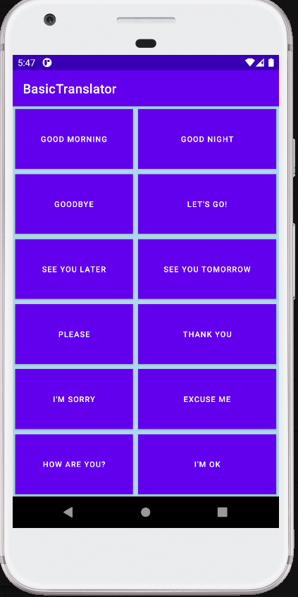

# BasicTranslator
Basic phrases translation from english to german. Text is english, voice is german.

<h3>User can:</h3>

- click on a phrase to hear its german translation.

<h3>Used technologies:</h3>

- kotlin,
- MediaPlayer,
- finding views from layout with view binding.

<h3>App main screen:</h3>
 

